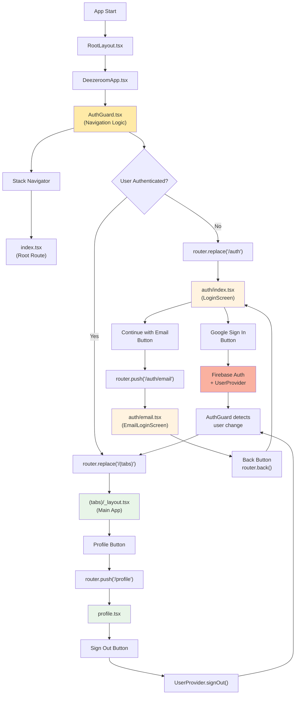

Get started with [EAS Hosting](https://docs.expo.dev/eas/hosting/introduction/).

## Project Scripts

`package.json` includes several useful scripts for development, verification, cleaning, and building:

### 🛠 Development

`npm run start` → Start Expo development server (default).

`npm run start:clear` → Start Expo server with cache cleared.

`npm run start:tunnel` → Start server using a tunnel (for external devices).

`npm run start:tunnel:clear` → Start tunnel with cache cleared.

`npm run android` → Launch app on an Android device/emulator.

`npm run ios` → Launch app on an iOS simulator/device.

`npm run web` → Launch app in a web browser.

### ✅ Quality & Verification

`npm run lint` → Run ESLint to check code style and potential issues.

`npm run lint:fix` → Run ESLint with automatic fixes for code style issues.

`npm run format` → Format all files with Prettier (enforces LF line endings).

`npm run format:check` → Check if all files are properly formatted without making changes.

`npm run fix:line-endings` → Convert all files to use LF line endings (Unix-style).

`npm run verify:deps` → Verify that installed dependencies match Expo SDK requirements.

`npm run verify:lockfile` → Dry-run installation to ensure `package-lock.json` is valid and consistent.

### 🧹 Cleaning & Reinstall

`npm run clean` → Remove all generated folders (`node_modules`, lockfile, Expo, Android/iOS/web builds).

`npm run c:i` → Clean the project and reinstall dependencies from scratch.

### 📦 Building

`npm run build:dev:android` → Create a development build for Android in the cloud.

`npm run build:dev:ios` → Create a development build for iOS in the cloud.

`npm run build:dev:web` → Create a development build for Web in the cloud.

`npm run build:prod:android` → Create a production build for Android in the cloud.

## Usefull commands

### Ensure installation

`"preinstall":`

```bash
npm install -g eas-cli && npm install --global @expo/ngrok@^4.1.0
```

### Managing Environment Variables

Check cloud envirement:

```bash
eas env:list
```

Push secret file (like `google-services.json`) to cloud builder:

```bash
npx eas env:create --scope project --name GOOGLE_SERVICES_JSON --type file --value ./credentials/android/google-services.json
```

## 🏗 Application Architecture

### Navigation Flow

The application uses Expo Router with a centralized authentication guard system:



### Key Components

- **AuthGuard**: Centralized authentication logic that monitors user state and handles navigation
- **UserProvider**: Manages Firebase authentication state and user profile data
- **Stack Navigator**: Handles all screen transitions and routing
- **LoginScreen**: Main authentication screen with Google Sign-In and email options
- **EmailLoginScreen**: Email/password authentication form (TODO: implementation)

### Authentication States

1. **Loading**: Shows loading indicator while checking auth state
2. **Unauthenticated**: User sees login screens (`/auth/*`)
3. **Authenticated**: User sees main app screens (`/(tabs)/*` and `/profile`)

### Navigation Rules

- `AuthGuard` automatically redirects based on authentication state
- Unauthenticated users → `/auth` screens
- Authenticated users → `/(tabs)` main app
- All navigation is handled through Expo Router with type-safe routing
