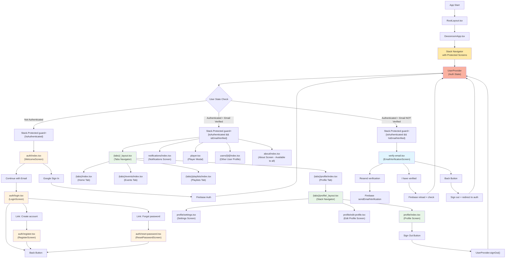

# DeezerRoom

A complete mobile solution focused on music and collaborative user experience. Built with React Native, Expo, Firebase, and a separate Next.js GraphQL API server.

**Live API Server:** [https://deezeroom-server.vercel.app/](https://deezeroom-server.vercel.app/)  
**Server Repository:** [https://github.com/jesuisstan/deezeroom-server](https://github.com/jesuisstan/deezeroom-server)

Get started with [EAS Hosting](https://docs.expo.dev/eas/hosting/introduction/).

## Project Scripts

`package.json` includes several useful scripts for development, verification, cleaning, and building:

### 🛠 Development

`npm run start` → Start Expo development server (default).

`npm run start:clear` → Start Expo server with cache cleared.

`npm run start:tunnel` → Start server using a tunnel (for external devices). Before running, ensure that `ngrok` is installed.

```bash
npm i -g @expo/ngrok
```

`npm run start:tunnel:clear` → Start tunnel with cache cleared.

`npm run android` → Launch app on an Android device/emulator.

`npm run ios` → Launch app on an iOS simulator/device.

`npm run web` → Launch app in a web browser.

### ✅ Quality & Verification

`npm run lint` → Run ESLint to check code style and potential issues.

`npm run lint:fix` → Run ESLint with automatic fixes for code style issues.

`npm run verify:deps` → Verify that installed dependencies match Expo SDK requirements.

`npm run verify:lockfile` → Dry-run installation to ensure `package-lock.json` is valid and consistent.

### 🧹 Cleaning & Reinstall

`npm run clean` → Remove all generated folders (`node_modules`, lockfile, Expo, Android/iOS/web builds).

`npm run fresh` → Clean the project and reinstall dependencies from scratch.

### 📦 Building

`npm run build:dev:android` → Create a development build for Android in the cloud.

`npm run build:dev:ios` → Create a development build for iOS in the cloud.

`npm run build:dev:web` → Create a development build for Web in the cloud.

`npm run build:prod:android` → Create a production build for Android in the cloud.

## Usefull commands

### Ensure installation

`"preinstall" / "prepare":`

```bash
npm install -g eas-cli && npm install --global @expo/ngrok@^4.1.0
```

### Managing Environment Variables

Check cloud envirement:

```bash
eas env:list
```

Push secret file (like `google-services.json`) to cloud builder:

```bash
npx eas env:create --scope project --name GOOGLE_SERVICES_JSON --type file --value ./credentials/android/google-services.json
```

```bash
npx eas env:create --scope project --name FIREBASE_ADMINSDK_JSON --type file --value ./credentials/android/deezeroom-1bc3c-firebase-adminsdk-fbsvc-e2b4ace5e3.json
```

## 🏗 Application Architecture

### Backend Architecture

DeezerRoom uses a **hybrid backend architecture** combining:

- **GraphQL API Server** (Next.js) - Separate server for music data operations
  - **Deployed at:** [https://deezeroom-server.vercel.app/](https://deezeroom-server.vercel.app/)
  - **Repository:** [https://github.com/jesuisstan/deezeroom-server](https://github.com/jesuisstan/deezeroom-server)
  - Provides GraphQL API endpoints for Deezer music data (tracks, artists, albums)
  - Handles search queries, popular tracks, and batch artist fetching
  - Built with Next.js 16, GraphQL Yoga, and TypeScript

- **Firebase** - Real-time collaborative features
  - Firestore for real-time database (events, playlists, user profiles)
  - Firebase Authentication (email/password, Google OAuth)
  - Firebase Storage (avatars, cover images)
  - Cloud Messaging for push notifications

**Environment Variables:**

- `EXPO_PUBLIC_SERVER_URL` - URL of the GraphQL API server (defaults to `http://localhost:3000` in dev, `https://deezeroom-server.vercel.app` in production)
- `EXPO_PUBLIC_APP_URL` - URL of the Expo app itself (for deep linking)

**Development Setup:**

For local development, you need to run both the client and server:

1. **Start the GraphQL server:**

   ```bash
   cd deezeroom-server
   npm run dev
   ```

   Server will be available at `http://localhost:3000/api/graphql`

2. **Start the Expo client:**
   ```bash
   cd deezeroom
   npm run start
   ```
   The client will automatically connect to the local server in dev mode.

### Navigation Flow

The application uses Expo Router with **Stack.Protected** screens for route-based authentication:



### Key Components

- **DeezeroomApp**: Main navigation component with Stack.Protected screens
- **UserProvider**: Manages Firebase authentication state and user profile data
- **Stack Navigator**: Handles all screen transitions with route-based protection
- **WelcomeScreen**: Entry screen with Google Sign-In and "Continue with email"
- **LoginScreen**: Email/password login form (`/auth/login`)
- **RegisterScreen**: Email/password registration form (`/auth/register`)
- **ResetPasswordScreen**: Password reset form (`/auth/reset-password`)
- **VerifyEmailScreen**: Email verification screen (`/verify-email`)

### Authentication States & Protected Routes

1. **Loading**: Shows `ActivityIndicatorScreen` while checking auth state
2. **Unauthenticated**: Protected by `guard={!isAuthenticated}`
   - `/auth/*` - All authentication screens
3. **Authenticated + Email Verified**: Protected by `guard={isAuthenticated && isEmailVerified}`
   - `/(tabs)/*` - Main app with tab navigation (includes profile tab with nested stack)
   - `/notifications` - Notifications screen
   - `/player` - Player modal
   - `/users/[id]` - Other user profiles
   - `/about` - About screen (available to all authenticated users)
4. **Authenticated + Email NOT Verified**: Protected by `guard={isAuthenticated && !isEmailVerified}`
   - `/verify-email` - Email verification screen

### Navigation Rules

- **Stack.Protected** automatically handles route access based on authentication state
- **No manual redirects** - routes are protected at the component level
- **Email verification required** - users must verify email before accessing main app
- **Type-safe routing** - All navigation through Expo Router with TypeScript support
- **Fallback handling** - `+not-found` screen for invalid routes

### Backend Services

- **GraphQL API** (Next.js Server):
  - `searchTracks` - Search tracks by keyword
  - `getPopularTracks` - Get trending tracks
  - `track` - Get track details by ID
  - `searchArtists` - Search artists by name
  - `artistsByIds` - Batch fetch artists by IDs

- **Firebase Services**:
  - **UserService** (`firebase-service-user.ts`) - Authentication and profile management
  - **EventService** (`firebase-service-events.ts`) - Music Track Vote events with real-time voting
  - **PlaylistService** (`firebase-service-playlists.ts`) - Collaborative real-time playlist editing
  - **Connections** (`firebase-service-connections.ts`) - Friend relationships and social features (functions, not a class)
  - **NotificationService** (`firebase-service-notifications.ts`) - Push notifications via Expo (singleton instance)
  - **StorageService** (`firebase-service-storage.ts`) - File storage and management

### Important links

- **Android DEV build apk**: Version 2.54.1, 26/11/2025. [Download](https://expo.dev/accounts/jesuisstan/projects/deezeroom/builds/d4dc8826-0368-4636-b5c2-bfc04b90c485) the .apk file
- **Android PRODUCTION build apk**: Version 2.54.2, 27/11/2025. [Download](https://expo.dev/accounts/jesuisstan/projects/deezeroom/builds/dfb92ecb-4bfc-41b5-87df-a67b3bd863d3) the .apk file
- **DeezeRoom WEB App**: dep;oyed on Expo available [here](https://deezeroom.expo.app)
- **DeezeRoom graphQL API (server)**: deployed on Vercel, available [here](https://deezeroom-server.vercel.app/)
- **Firebase console**: available [here](https://console.firebase.google.com/u/0/project/deezeroom-1bc3c/firestore/databases/-default-/data/)
